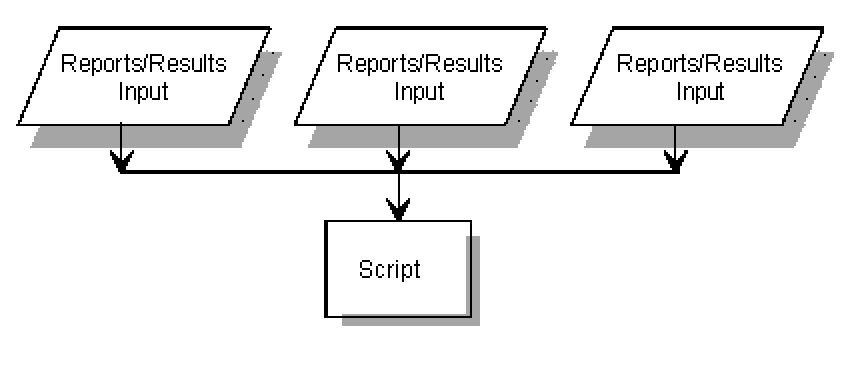
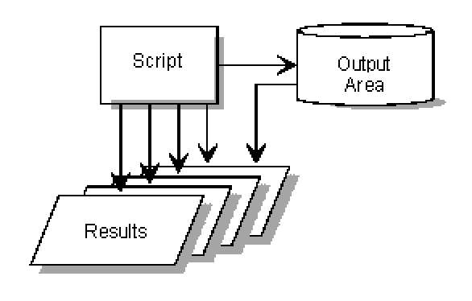
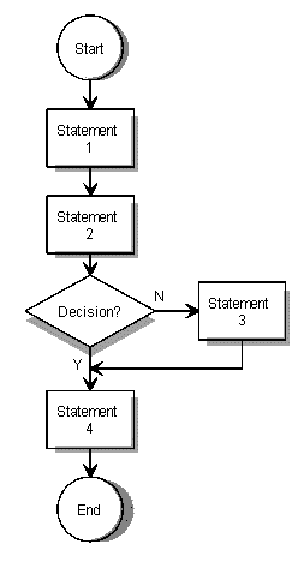

# Script Design Overview

## Overview

This section covers the following topics:
- [What Is a Script?](#what-is-a-script)
- [What Does a Script Process?](#what-does-a-script-process)
- [Business Information Server Statements](#business-information-server-statements)
- [Run Control Reports](#run-control-reports)
- [The Output Area and Results](#the-output-area-and-results)
- [Creating a Script](#creating-a-script)

---

## What Is a Script?

A script is a series of statements in a report that specify step-by-step instructions for BIS software to follow. A script replaces a series of manual functions that would otherwise be performed repeatedly. The simplest script processes data in a report and produces an updated report.

Scripts save time and reduce the risk of input mistakes. They also enable operations that are impossible to perform using only manual functions, including:

- Generating reports and results
- Executing other BIS operations
- Creating unique report formats
- Making logical decisions
- Manipulating data in BIS reports

Scripts are written in run control reports and identified by name. To initiate a script, enter its name on the control line. Ask your BIS administrator for the location of example scripts on your system, such as `DEMO` and `EDIT`.

---

## What Does a Script Process?

A single script can access and process data from:
- An unlimited number of reports
- An unlimited number of cabinets
- Up to 16 result reports

A script always has access to the cabinet of the user executing it as well as cabinet 0. Contact your administrator to allow your script to access other cabinets.

---

## Business Information Server Statements

> *This section is referenced but not yet documented. See the BIS Command Reference for information on available statements.*

---

## Run Control Reports

A run control report is a standard freeform report containing sequential statements of step-by-step instructions for processing reports, results, or other data.

A cabinet can contain one or more drawers reserved for run control reports, depending on departmental needs. These reports behave like other reports — they have a control line and a date line, and their contents can be updated using manual updating commands. Like other reports, a run control report can be identified by cabinet number, drawer letter, and report number, or by a name assigned through the `NAME` script.

You can use run control reports in cabinet 0, drawer E for practicing script design. Use the run control drawer in your department's cabinet when writing scripts for production.

> *(Windows / Linux / UNIX)* Run control reports with a read password cannot be executed. If you cannot display reports in cabinet 0, drawer E, contact your system administrator — these reports are subject to security access controls.

> *(OS 2200)* **Drawer A Reports** — Drawer A is accessible to all users. Reports in drawer A can be secured by no more than a read or write password.

---

## The Output Area and Results

### Output Area

The output area is a temporary scratch area built during script execution to hold information. It consists of **output lines** — lines of data that do not have `@` or `:` in column 1 and are not continuations of statement lines. The output area might contain, for example, messages or special screen displays to be shown later in the script.

- To examine the output area at any point during the script, use a `GTO END` statement. This displays the output area contents as a result.
- To use the output area as a result, execute a **Break** (`BRK`) statement. `BRK` places the output area into the current result and creates a new, empty output area. You can then display the result using the `DSP`, `OUT`, `SC`, or `DSX` statement.
- You can build the output area without affecting the current result or any previously renamed results.

> Do not confuse the output area with a result. Results are created by manual functions or statements such as `SRH` or `TOT`. The output area can be turned into a result using the `BRK` or **Break Graphics** (`BRG`) statements.

### Results

A result is a temporary report obtained by executing a BIS manual function or statement. When initially created, a result always has a report number of `-0`. A script can save up to 16 results for subsequent access, using report numbers `-1` through `-16`. These renamed results are saved only for the duration of the script.

- To rename a result, use the **Rename** (`RNM`) statement.
- To access a result, specify its report number in the appropriate subfields of a statement. For example: `@dsp, -0`

The `-0` input to a script may be either a result or a report on display.

### Relationship Between Output Area and Results

The following figure illustrates how scripts use the output area and results.

---

## Creating a Script

Creating a new script involves five steps:

1. **Plan** your script so it solves the problem or performs the desired operation effectively and efficiently.
2. **Create and register** a run control report where the statements will be written and tested.
3. **Write** the individual statements that constitute the script.
4. **Debug and optimize** statements until the script performs the desired operations efficiently and without error.
5. **Submit** your script to the system administrator for analysis and final registration.

### Step 1: Planning Your Script

Determine which statements you want to execute and whether you will use logical decisions, paths, or loops. Drawing a flowchart to map out the processing steps can be helpful.

> **Tip:** If you are unsure what effect a statement has in a script, you can usually test it by running the statement separately.

### Step 2: Creating and Registering a Run Control Report

1. Execute the **Cabinet Table of Contents** (`T`) command to identify which drawer is available in your cabinet for scripts.
2. Use the **Add Report** (`AR`) command to add a report in that drawer.
3. Provide the administrator with the report number and drawer, the proposed script name, the cabinets to be accessed, and the departments that will use the script. The administrator assesses the proposed script's impact on the system and, if acceptable, registers the script for online debugging.

### Step 3: Writing the Individual Statements

Gain experience with individual manual functions before writing statements. See [Optimizing Your Scripts](optimizing_scripts.md) for more information.

### Step 4: Debugging and Optimizing Statements

When an error is encountered during a script:

1. The script stops.
2. The portion of the script containing the error is displayed, if you were the last person to update the script and you are registered as a script designer.
3. A system message is displayed on the control line.
4. All results become inaccessible, unless a **Register Error Routine** (`RER`) subroutine is present in the script or the script is executing in **Run Debug** (`RDB`) mode.

**To correct an error:**

1. Press **Help** for online information about the error.
2. Press **Help** again for more detailed information, or press **Return** to redisplay your script.
3. Make the necessary corrections and re-execute the script.

For more information, see [Analyzing and Debugging Your Scripts](analyzing_debugging_scripts.md).

### Step 5: Submitting Your Script to the Administrator

After accepting your script, the administrator registers it by name and may restrict any of the following:

- User accessibility
- Cabinet accessibility
- Time of execution
- Input/output quantity
- Logic line count
- Station numbers

If you change your script significantly, the administrator must analyze it again.

When a script is ready for production, execute it with logging turned on and have the administrator assess its impact on the system via the log list. The administrator may suggest further improvements.
