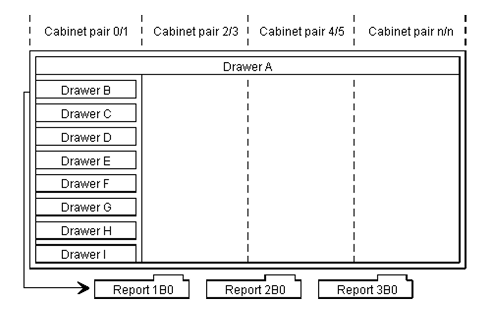

# Database Structure

## Overview

The method of organizing information within a BIS database mirrors that of a traditional office. Think of the database as a large storage room containing filing cabinets, which in turn contain drawers, which in turn contain reports. Even the terminology remains the same. You access cabinets, drawers, and reports to recall, review, and revise information in your BIS database.

The following figure gives a visual representation of the database structure.

---

## Cabinets

Cabinets are sections of the database used to store information on a specific aspect of your organization or operation. For example, one cabinet might contain accounting data, another sales data, and a third shipping data.

Cabinets are numbered in **pairs** (even/odd), starting with pair `0/1`.

### OS 2200

In each cabinet pair, both cabinets hold exactly the same data, but with different access:
- **Even-numbered cabinet** — read and write access
- **Odd-numbered cabinet** — read-only access

This allows some users to update data while others can only view it.

| | Default | Maximum |
|---|---|---|
| Cabinet pairs | 401 | 2048 |
| Cabinet numbers | 0–4095 | — |

### Windows / Linux / UNIX

The system administrator sets up security groups that control read and write access to cabinets and drawers. The system contains **2001 cabinet pairs**: cabinets `0` through `4001`.

---

## Drawers

Each BIS cabinet contains **eight drawers**, named by letter: **A through I**. Drawers can also have substitute names — see the Command Reference for details.

Each drawer is a subcategory for the specific topic to which its cabinet is dedicated (for example, a sales cabinet might have one drawer per salesperson).

| Drawer | Description |
|--------|-------------|
| **A** | Freeform drawer — like a blank sheet of paper, usable for any data or communication. Shared by all cabinets. Not displayed in the drawer table of contents. Contains general, unprotected information. |
| **B–I** | Structured database drawers, laid out in either line-and-column format or freeform (like drawer A). |

> *(Windows / Linux / UNIX)* Read and write access to drawer A is restricted by a security group. Contact your supervisor or system administrator if you need access.

Drawers are planned by one or more users and generated by the administrator.

---

## Reports

Each drawer can store a large number of reports containing detailed information, typically organized on a line-by-line basis (for example, all sales closed during a specific month for a particular salesperson).

### Identifying Reports

Reports can be identified by any of the following:

| Format | Example | Description |
|--------|---------|-------------|
| Report name | `Monthly` | A named report |
| Report number + drawer | `2B` | Report 2 in drawer B |
| Report number + drawer + cabinet | `2B0` | Report 2 in drawer B of cabinet 0 |

For information on assigning substitute names to reports, see the Command Reference.

### Report Size

Reports can contain a limited number of lines. Use the `LIMITS` command to display the line limit for your system.

> **Recommendation:** Use multiple reports with a reasonable number of lines rather than one large report, for the most efficient use of system resources.

For details on the structure of BIS reports, see *Managing Reports*.
